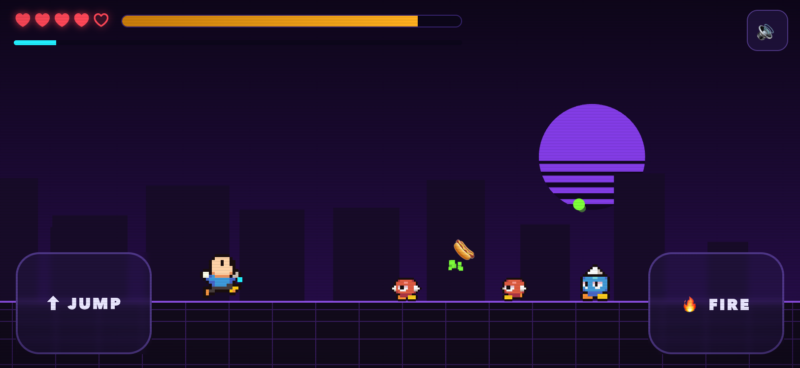
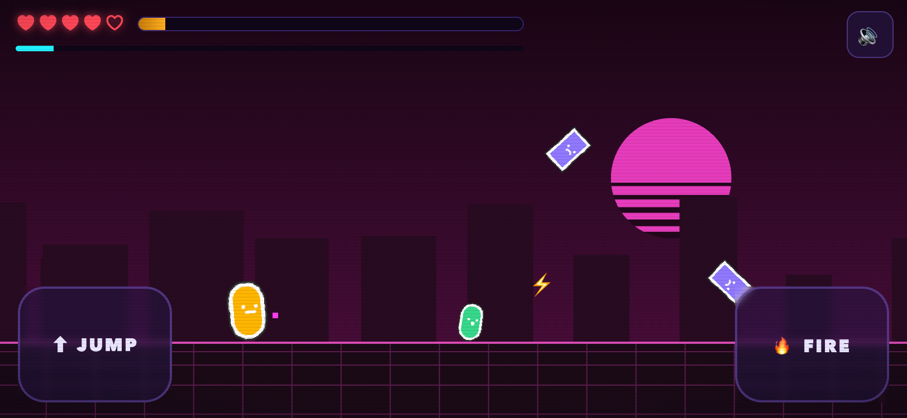
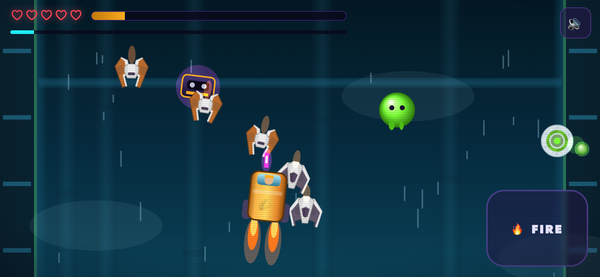
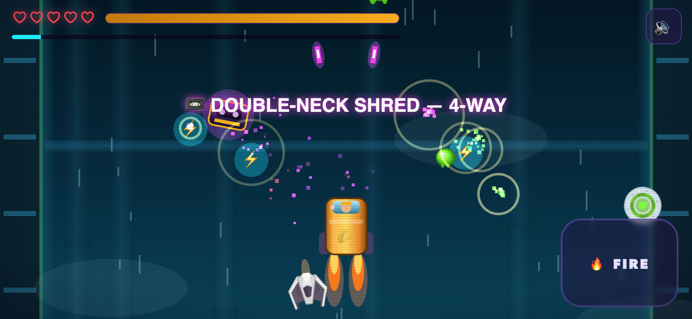
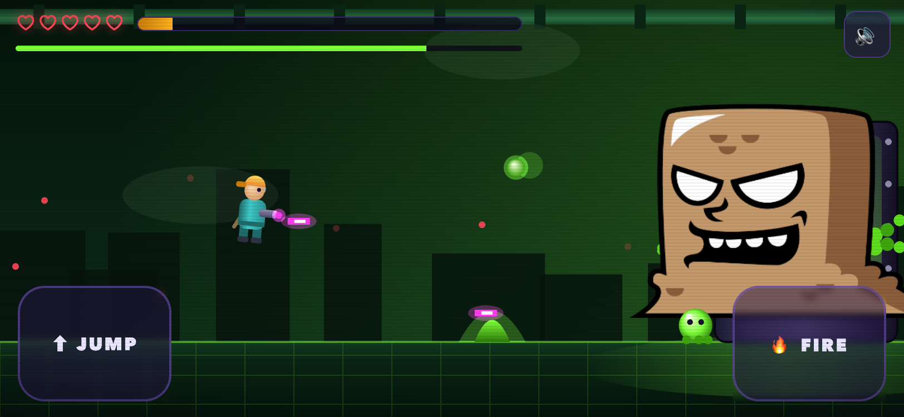
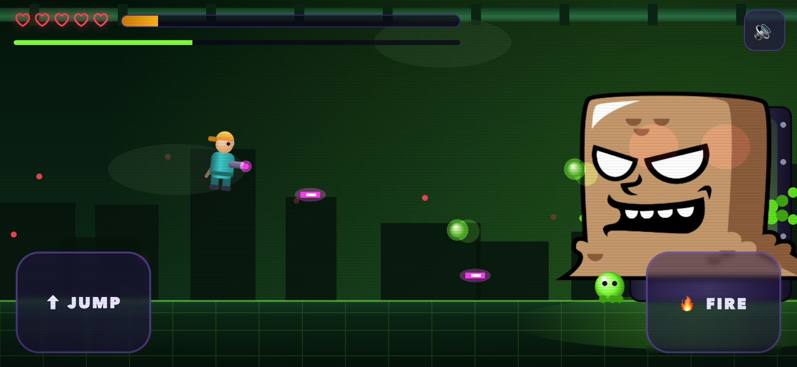
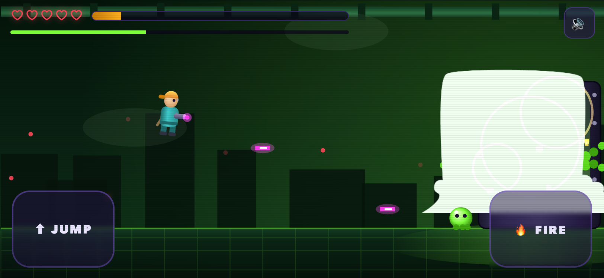
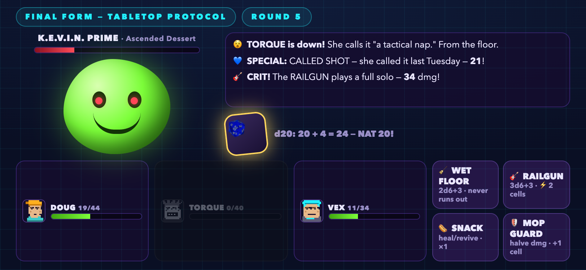

# 🧹 JANITOR OF TOMORROW

*A time-war comedy.* Mop tonight. Save 2099. Try not to die in a mall.

**▶ [PLAY IT](https://thoncs.github.io/janitor-of-tomorrow/)** — landscape phone or desktop, one self-contained HTML file. No build, no server, no dependencies.

Doug Pickles — night janitor, world #1 ranked player of GRIME WAR 2099, owner of one (1) fork — is dragged into a time-war by two dangerous future soldiers and must stop PROJECT CUSTARD before dessert liquefies civilization.

## What's inside

- 3 branching story scenes with consequences, 2 companion trust meters, 1 timeline stability meter
- **CH.1–2**: side-scroller shooter boards
- **CH.3**: vertical shmup ascent with a flying taco truck and directional weapon pickups
- Boss fight against **K.E.V.I.N.** (Kinetic Enzyme Vat, Infinitely Networked)
- Final form: a **turn-based, d20-rolling tabletop battle** with your full party
- 3 endings, snacks as health, hair metal as a weapon system

The graphics engine "escalates" per level — NES-style pixels → notebook doodles → 64-bit gradients → graph paper and real rendered dice. This is canon.

## Screenshots

**The boards**

| | |
|---|---|
|  |  |
| *CH.1 — Mop & Destroy* | *CH.2 — Escalator to Hell* |
|  |  |
| *CH.3 — Custard Ascent* | *Directional weapons: DOUBLE-NECK SHRED* |

**The bosses**

| | |
|---|---|
|  |  |
| *K.E.V.I.N. in the vat* | *Enraged below half health* |
|  |  |
| *...and down* | *Final form: K.E.V.I.N. PRIME, on graph paper* |

## Run locally

Open `index.html` in a browser. That's it.

## Art credits

Guest art from [OpenGameArt.org](https://opengameart.org):

- [Classic Hero](https://opengameart.org/content/classic-hero) & [Classic hero and baddies pack](https://opengameart.org/content/classic-hero-and-baddies-pack) by **GrafxKid** — CC0
- [Scribble Platformer](https://opengameart.org/content/scribble-platformer) & [Space Shooter Redux](https://opengameart.org/content/space-shooter-redux) by **[Kenney.nl](https://kenney.nl)** — CC0
- [Chocolate Monster Sprite Sheets](https://opengameart.org/content/chocolate-monster-sprite-sheets) by **[bevouliin.com](https://bevouliin.com)** — [CC-BY 3.0](https://creativecommons.org/licenses/by/3.0/)
- [D20 rolling animations](https://opengameart.org/content/d20-rolling-animations) by **lukems-br** — CC0

Everything else (code, writing, remaining pixel/vector art) is original. An original parody — no real timelines were harmed.
