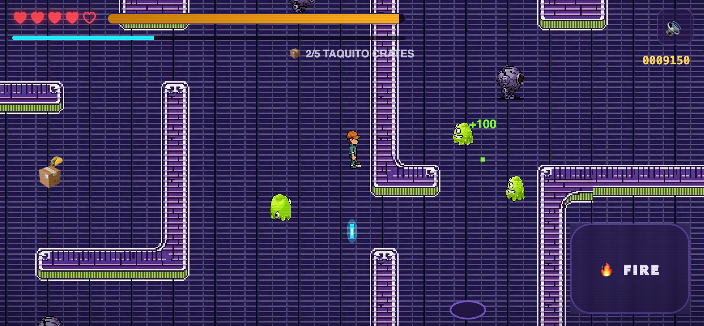

# 🧹 MOP WAR OF 2076

*A time-war comedy.* Mop tonight. Save 2076. Try not to die in a mall.

**▶ [PLAY IT](https://thoncs.github.io/janitor-of-tomorrow/)** — landscape phone or desktop, one self-contained HTML file. No build, no server, no dependencies.

Doug Pickles — night janitor, world #1 ranked player of GRIME WAR 2076, owner of one (1) fork — is dragged into a time-war by two dangerous future soldiers and must stop PROJECT CUSTARD before dessert liquefies civilization.

## What's inside

- 3 branching story scenes with consequences, 2 companion trust meters, 1 timeline stability meter
- **CH.1–2**: side-scroller shooter boards
- **CH.2.5**: 🏁 **TAQUITO GRAND PRIX** — a Pole Position-style pseudo-3D race across the wasteland
- **CH.3**: vertical shmup ascent with a flying taco truck and directional weapon pickups
- **OPERATION: FLOOR PLAN** — 🗺️ a Risk-style, dice-driven territory war for the vat floor
- **BONUS: SUPPLY DUNGEON** — 🪠 a Zelda-style top-down crawl under the core: 8-direction Doug,
  goo chasers, taquito crates, and the GOLDEN PLUNGER (+1 max ♥)
- **BONUS: TIME WARP ZONE** — 🌀 Sublevel B remembered wrong: colder, denser, and the board's clock
  speeds up and slows down on its own while you're standing in it
- **VS GLAZE** — 🍩 an MK-style 1v1 against the Forbidden Donut, ending in **MOPTALITY**
- Boss fight against **K.E.V.I.N.** (Kinetic Enzyme Vat, Infinitely Networked) — who leaks a little
  more of his backstory each time you knock a chunk off him
- Final form: a **turn-based, d20-rolling tabletop battle** — limit breaks, magic + MP, a once-per-battle
  **SUMMON: FREIGHT ELEVATOR**, and a phase-two **K.E.V.I.N. OMEGA** with a second health bar
- **6 endings** — the timeline you leave behind, crossed with whether you kept Torque and Vex close.
  Same future, very different goodbye
- Snacks as health, hair metal as a weapon system, 7 collectible lore notes
- Combo announcer, flying-hat physics, CHONKY BOY, and 🌮 TAQUITO TIME — big dumb fun is a design pillar

## It remembers you now

- **CONTINUE** picks up where you stopped, and keeps your 🌮 taquito wallet, per-board best scores,
  recovered lore and unlocked dossiers
- **Four difficulty tiers** — CHILL to NIGHTMARE, switchable mid-shift. They tune how many hostiles turn up
  and how long you're invincible after a hit; they never touch your own damage
- **Mid-board checkpoints** — die after halfway and you restart from the middle, not the beginning
- **Pause** (⏸ or `Esc`) — stats, unlockable character dossiers, recovered lore, and options
- **Options that matter on a phone** — master / music / ambience / effects faders, and touch pads you can
  resize and lift to fit the hand actually holding the thing
- **Every board explains itself** — a control card the first time you play each one, because the race and
  the dungeon were previously a guessing game
- 🗺️ **FACILITY MAP** — add [`?hub=1`](https://thoncs.github.io/janitor-of-tomorrow/?hub=1) to the URL for a
  node map of all nine boards with best scores and fog of war. Experimental; the story path is unchanged

The graphics engine "escalates" per level — NES-style pixels → notebook doodles → 64-bit gradients → graph paper and a glowing d20. This is canon.

## Screenshots

**Title & story**

| | |
|---|---|
|  |  |
| *Insert courage to begin* | *Act 1 — the supply closet explodes* |
|  |  |
| *Choices have consequences (and chips)* | *TAQUITO TIME meets CHONKY BOY* |

**The boards**

| | |
|---|---|
|  |  |
| *CH.1 — Mop & Destroy* | *CH.2 — Escalator to Hell* |
|  |  |
| *CH.2.5 — Taquito Grand Prix* | *Local wildlife* |
|  |  |
| *Operation: Floor Plan* | *BONUS — Supply Dungeon, suddenly a Zelda-like* |
|  | |
| *M O P T A L I T Y* | |
|  |  |
| *CH.3 — Custard Ascent* | *Directional weapons: DOUBLE-NECK SHRED* |
|  |  |
| *VS GLAZE — the Forbidden Donut* | *K.E.V.I.N. OMEGA — the Last Custard* |

**The bosses**

| | |
|---|---|
|  |  |
| *Pay-per-view energy* | *K.E.V.I.N. in the vat* |
|  |  |
| *Enraged below half health* | *...and down* |
|  |  |
| *TABLETOP PROTOCOL engages* | *Final form: K.E.V.I.N. PRIME, on graph paper* |

## Asset catalog

Want to reskin it? **[assets.html](https://thoncs.github.io/janitor-of-tomorrow/assets.html)** is a catalog of
every sprite and drawn entity — code hooks, native sizes, usage, and one-line swap instructions.

It's a second copy of the art, so it can drift from the game — and it had, silently, for 11 of the 52 sprites.
`tools/sync-assets.mjs` now keeps it honest.

## Run locally

Open `index.html` in a browser. That's it.

## Verifying changes

All of the game's JavaScript lives in **one** `<script>` block. A SyntaxError anywhere in it means *zero*
JavaScript executes — but the HTML/CSS title screen still paints, so the page looks loaded and every tap does
nothing. It reads exactly like broken input. Two tools guard that, neither with any dependencies:

```bash
node tools/check.mjs index.html && node tools/smoke.mjs "$PWD/index.html"
```

- **`tools/check.mjs`** — compiles the inline script with `vm.Script` (classic-script semantics, unlike
  `node --check`) and reports any SyntaxError mapped back to an `index.html` line. Milliseconds.
- **`tools/smoke.mjs`** — loads the page in headless Chrome and asserts the script ran, nothing threw, and
  **clicking START MISSION actually changes screen**. ~4s. This catches what the gate can't: a runtime throw
  parses fine and still kills the whole game.
- **`tools/sync-assets.mjs`** — checks the reskin catalog still matches the game's art, and `--fix` resyncs it.

### Jumping straight to a board

Playing up to a board to check it is miserable. Append `?board=<id>` to go straight there:

```
index.html?board=race
index.html?board=race&fresh=1     # also wipes the save, so control cards and lore show as new
```

Ids: `ch1` `ch2` `race` `ch3` `war` `glaze` `boss` `dungeon` `warp`. Works over `file://` too, so you can
open the file in Safari, add the parameter, and be on the board in one tap. A bad id is ignored and the game
boots normally. `?hub=1` gives the facility map instead, if you want to pick from a menu.

Git never tracks `.git/hooks/`, so after a clone re-arm the hooks once:

```bash
sh tools/install-hooks.sh
```

That installs `pre-commit` (gate on staged content) and `pre-push` (gate + smoke, plus a non-blocking note if
the asset catalog has drifted — pushing to `main` deploys straight to the live URL).

## Art credits

> **art: PUDD-CO Graphics Division** *(a wholly-owned subsidiary of the evil pudding conglomerate)*

The cast — Doug, the goo critters, CHONKY BOY, the sentinel, the story portraits, **GLAZE the
Forbidden Donut**, **K.E.V.I.N.** in all his forms, and all vehicles (the taco truck, fighter jets,
wall pods, tankers, cassette pickups) — is AI-generated with
[PixelLab](https://pixellab.ai) from PUDD-CO's character bible. Every other sprite is original,
authored in-engine at ≥64px.
Code, writing, and music are original. An original parody — no real timelines were harmed.
