# 🧹 JANITOR OF TOMORROW

*A time-war comedy.* Mop tonight. Save 2099. Try not to die in a mall.

**▶ [PLAY IT](https://thoncs.github.io/janitor-of-tomorrow/)** — landscape phone or desktop, one self-contained HTML file. No build, no server, no dependencies.

Doug Pickles — night janitor, world #1 ranked player of GRIME WAR 2099, owner of one (1) fork — is dragged into a time-war by two dangerous future soldiers and must stop PROJECT CUSTARD before dessert liquefies civilization.

## What's inside

- 3 branching story scenes with consequences, 2 companion trust meters, 1 timeline stability meter
- **CH.1–2**: side-scroller shooter boards
- **CH.2.5**: 🏁 **TAQUITO GRAND PRIX** — a Pole Position-style pseudo-3D race across the wasteland
- **CH.3**: vertical shmup ascent with a flying taco truck and directional weapon pickups
- **OPERATION: FLOOR PLAN** — 🗺️ a Risk-style, dice-driven territory war for the vat floor
- **VS GLAZE** — 🍩 an MK-style 1v1 against the Forbidden Donut, ending in **MOPTALITY**
- Boss fight against **K.E.V.I.N.** (Kinetic Enzyme Vat, Infinitely Networked)
- Final form: a **turn-based, d20-rolling tabletop battle** — limit breaks, magic + MP, a once-per-battle
  **SUMMON: FREIGHT ELEVATOR**, and a phase-two **K.E.V.I.N. OMEGA** with a second health bar
- 3 endings, snacks as health, hair metal as a weapon system
- Combo announcer, flying-hat physics, CHONKY BOY, and 🌮 TAQUITO TIME — big dumb fun is a design pillar

The graphics engine "escalates" per level — NES-style pixels → notebook doodles → 64-bit gradients → graph paper and a glowing d20. This is canon.

## Screenshots

**Title & story**

| | |
|---|---|
| 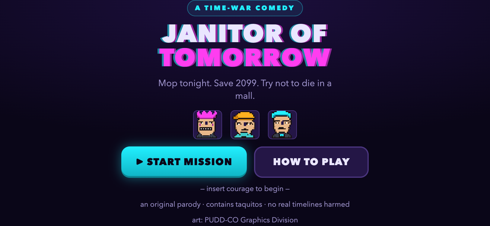 | 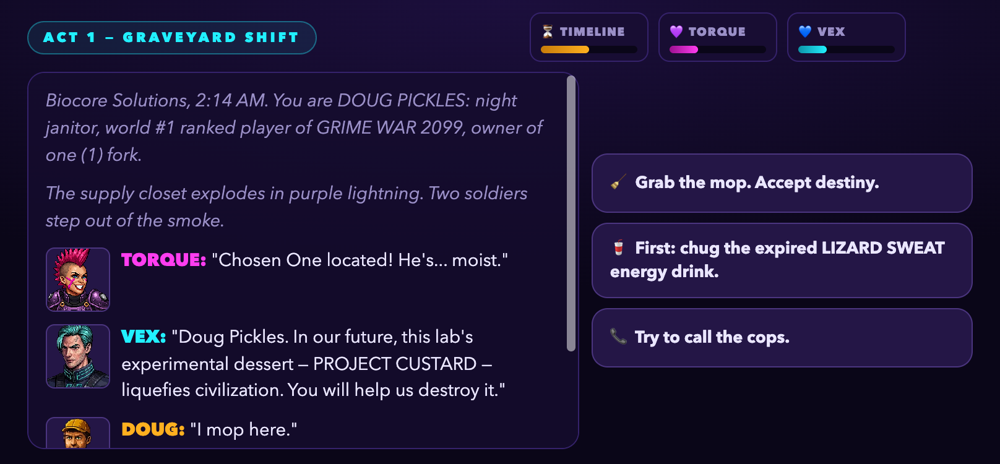 |
| *Insert courage to begin* | *Act 1 — the supply closet explodes* |
| 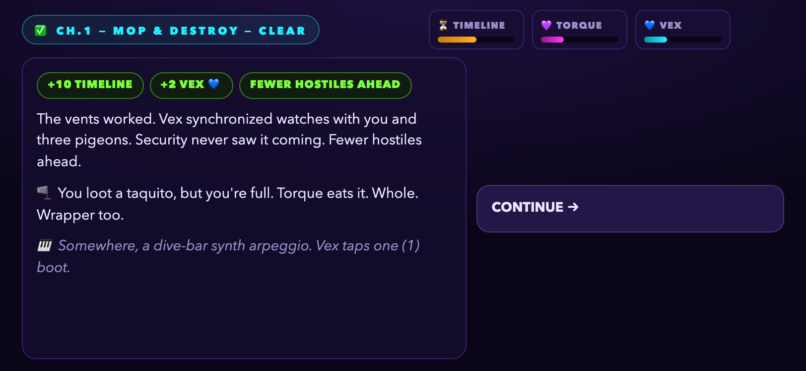 | 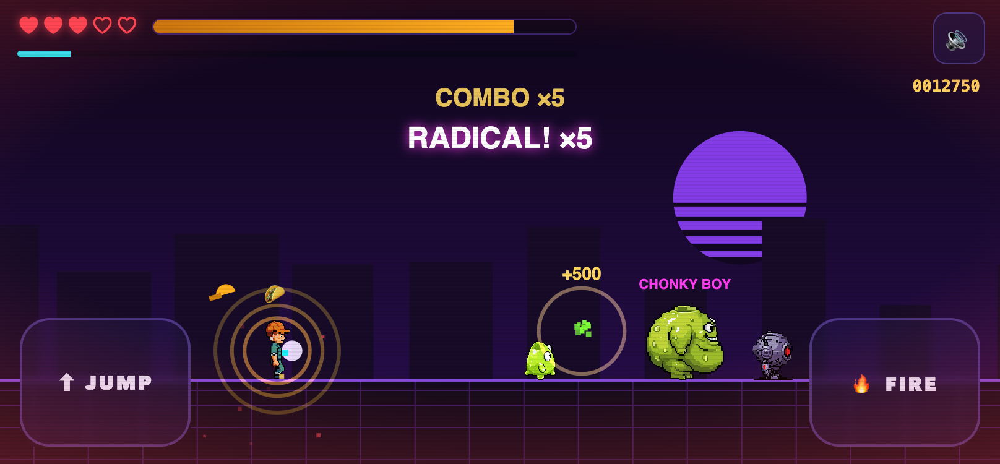 |
| *Choices have consequences (and chips)* | *TAQUITO TIME meets CHONKY BOY* |

**The boards**

| | |
|---|---|
| 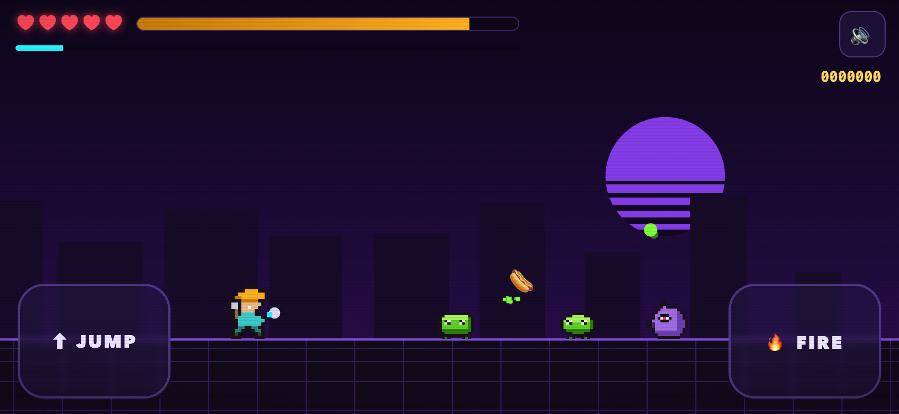 | 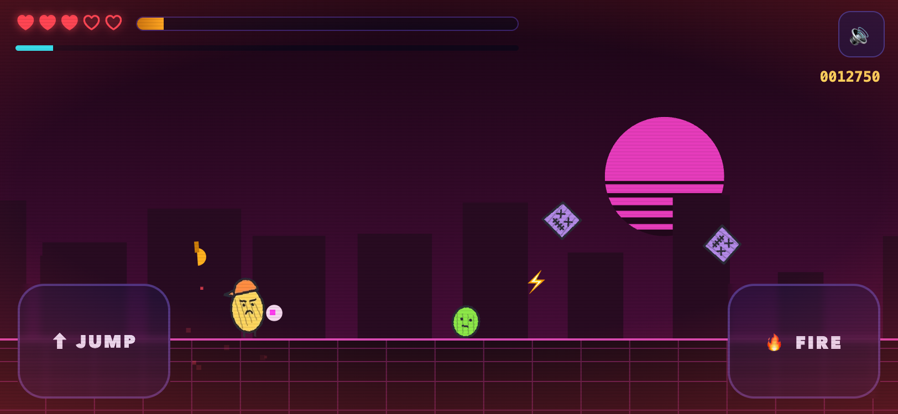 |
| *CH.1 — Mop & Destroy* | *CH.2 — Escalator to Hell* |
| 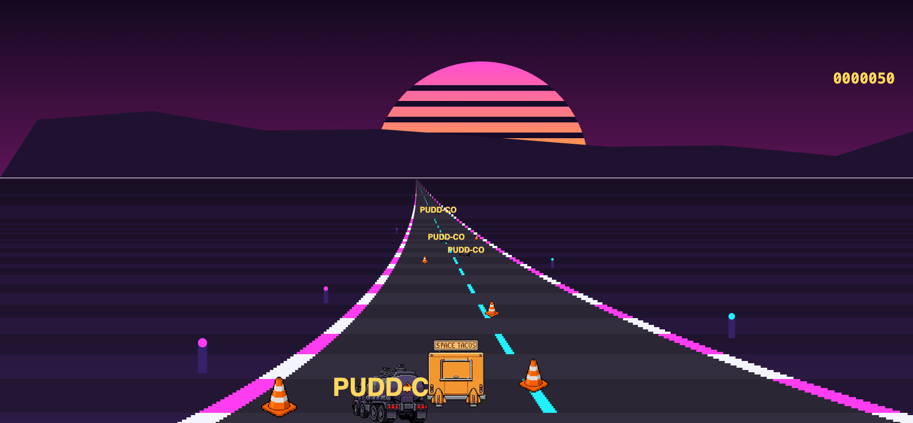 | 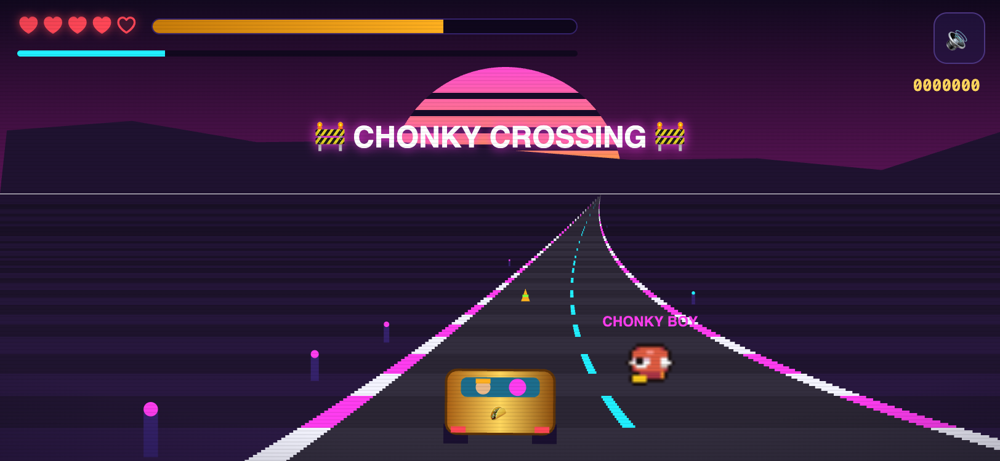 |
| *CH.2.5 — Taquito Grand Prix* | *Local wildlife* |
| 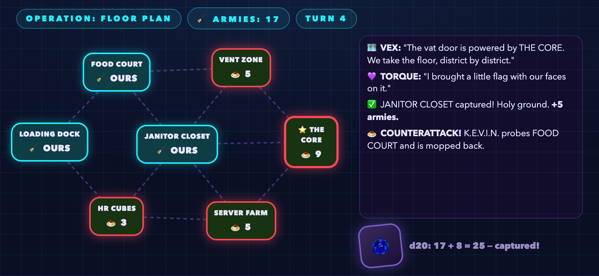 | 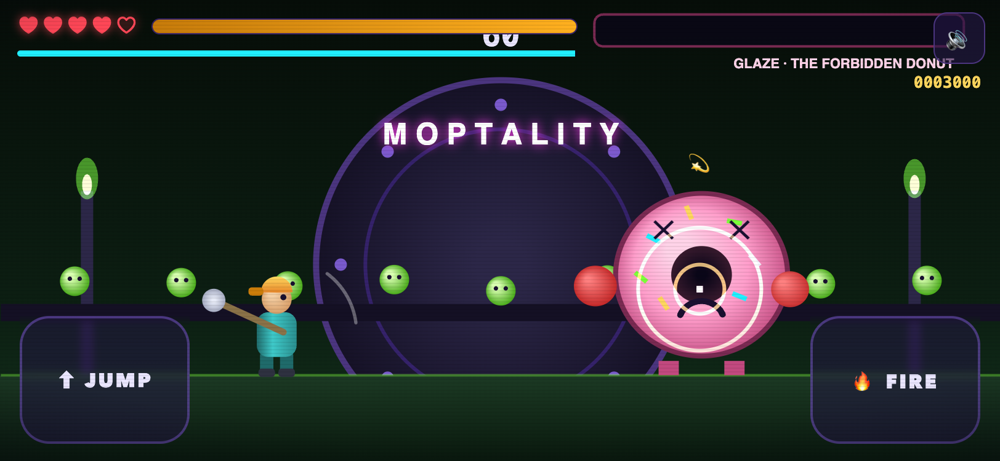 |
| *Operation: Floor Plan* | *M O P T A L I T Y* |
| 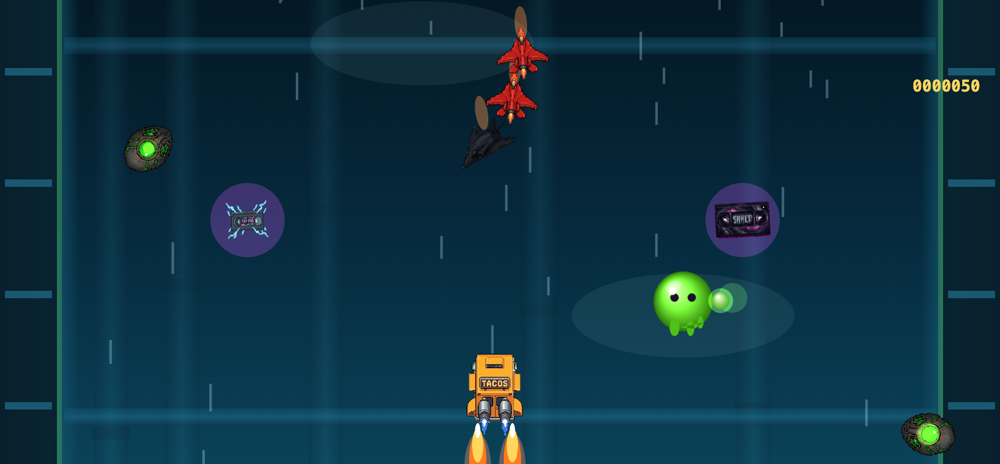 | 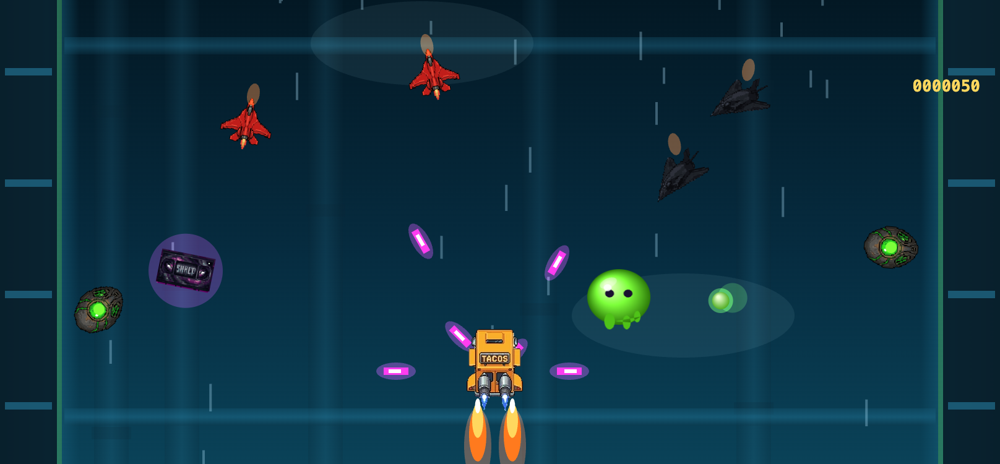 |
| *CH.3 — Custard Ascent* | *Directional weapons: DOUBLE-NECK SHRED* |
| 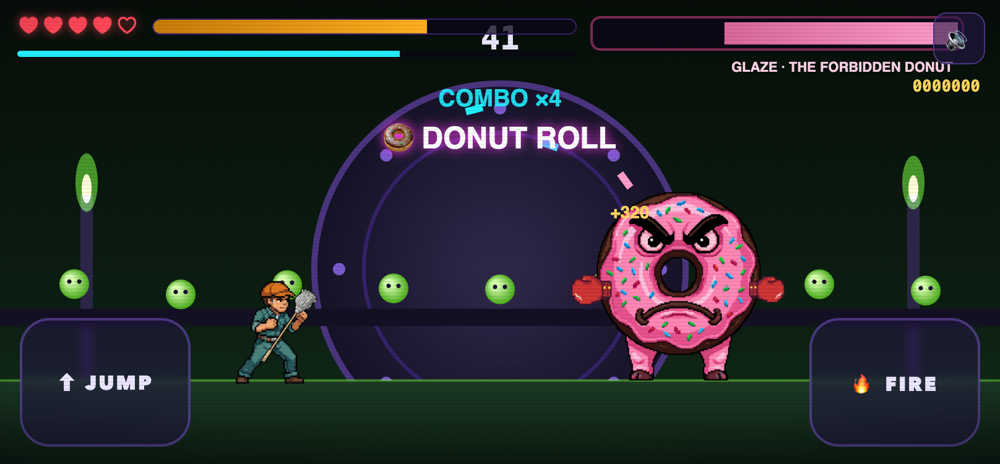 | 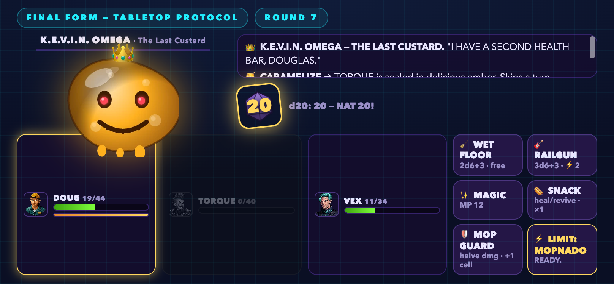 |
| *VS GLAZE — the Forbidden Donut* | *K.E.V.I.N. OMEGA — the Last Custard* |

**The bosses**

| | |
|---|---|
| 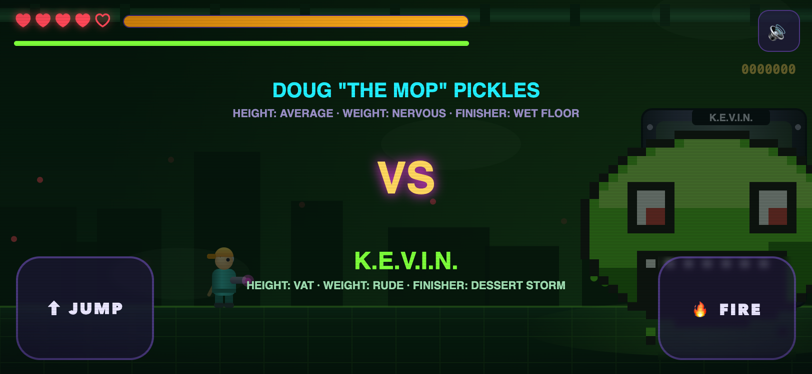 | 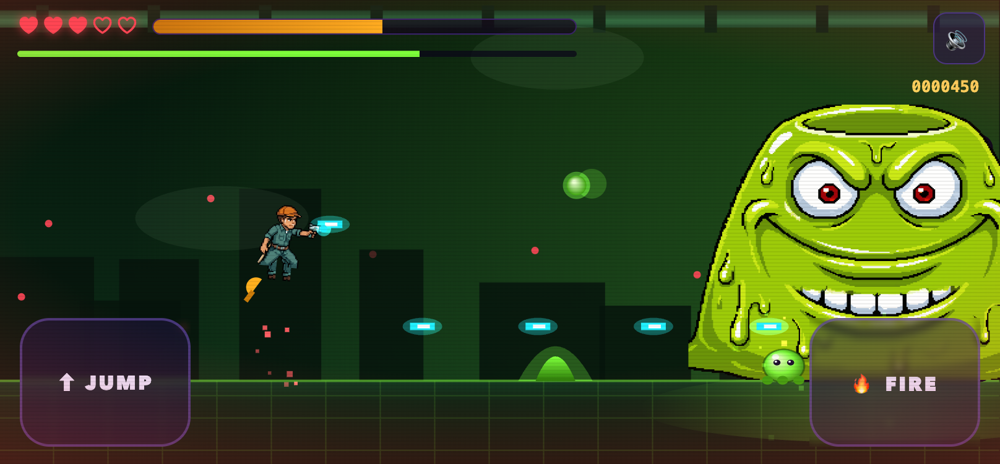 |
| *Pay-per-view energy* | *K.E.V.I.N. in the vat* |
| 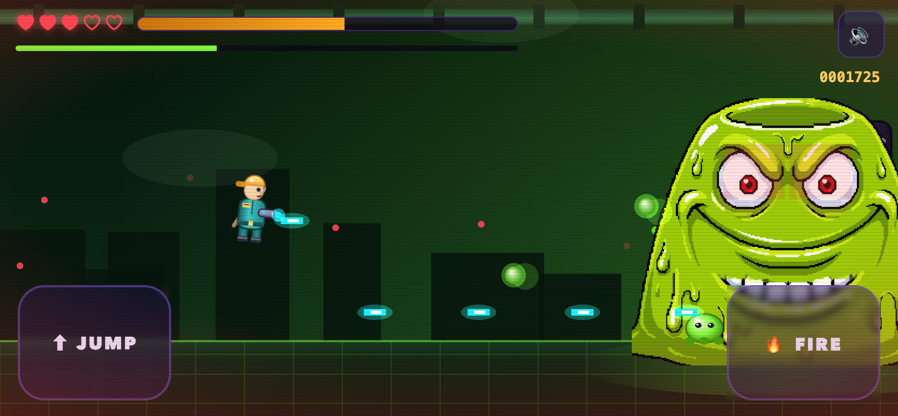 | 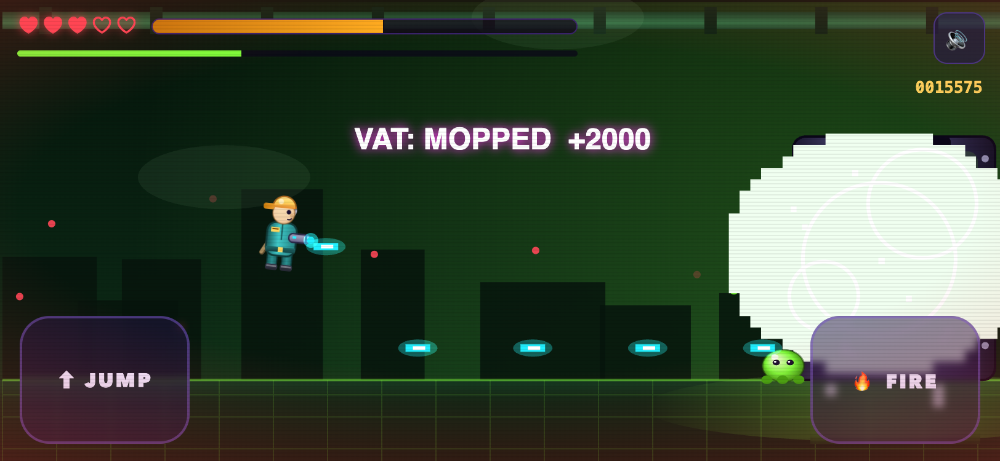 |
| *Enraged below half health* | *...and down* |
| 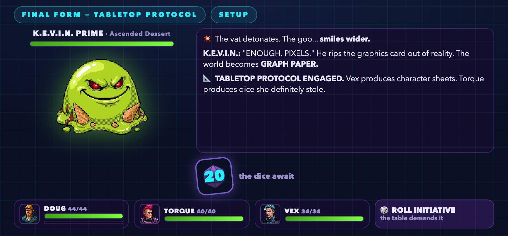 | 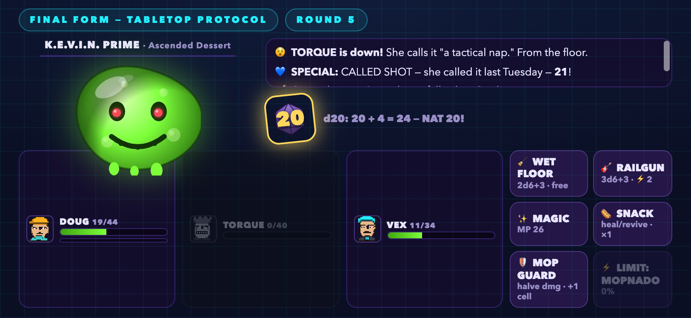 |
| *TABLETOP PROTOCOL engages* | *Final form: K.E.V.I.N. PRIME, on graph paper* |

## Asset catalog

Want to reskin it? **[assets.html](https://thoncs.github.io/janitor-of-tomorrow/assets.html)** is a generated
catalog of every sprite and drawn entity — code hooks, native sizes, usage, and one-line swap instructions.

## Run locally

Open `index.html` in a browser. That's it.

## Art credits

Every sprite is original, authored in-engine at ≥64px source resolution by the studio the future deserves:

> **art: PUDD-CO Graphics Division** *(a wholly-owned subsidiary of the evil pudding conglomerate)*

Code, writing, and music are original too. An original parody — no real timelines were harmed.
